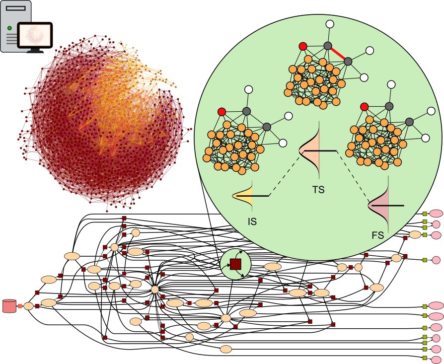
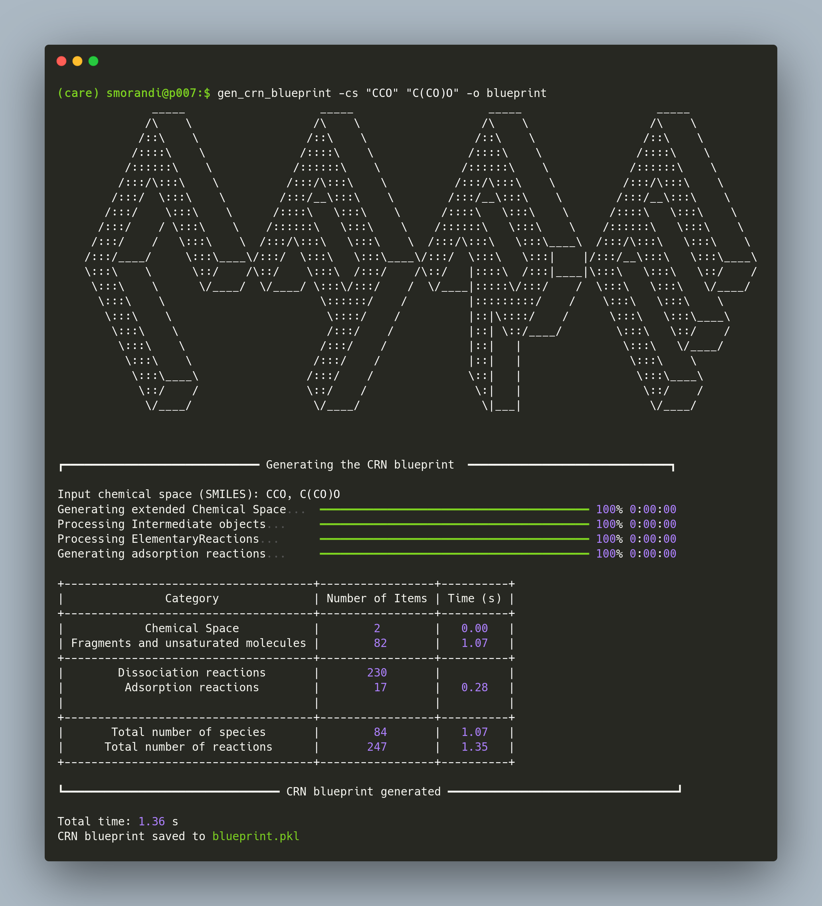

[](https://doi.org/10.26434/chemrxiv-2024-bfv3d)
[](./LICENSE)

[](https://github.com/LopezGroup-ICIQ/care/actions/workflows/python-package.yml)
[](https://www.rdkit.org/)

# CARE: Catalysis Automated Reaction Evaluator

<div style="display: flex; justify-content: center; align-items: center;">
    <p align="center">
     
    </p>
</div>

CARE (*Catalysis Automated Reaction Evaluator*) is a tool for generating and manipulating chemical reaction networks (CRNs) on heterogenous catalysts. CARE is powered by data-driven models such as [GAME-Net-UQ](https://github.com/LopezGroup-ICIQ/gamenet_uq), [Open Catalyst](https://github.com/FAIR-Chem/fairchem) models, and [MACE](https://github.com/ACEsuit/mace) potentials.

## 🪛 Installation

Installing CARE requires Conda and Git locally installed. The following instructions are optimized to install CARE on Linux and macOS machines. Installation time estimates are provided for each step on an Ubuntu 24.04.01 (x86_64, 16 GB RAM, internet speed 170 Mbps) and macOS 15.3.1 (arm64, 8 GB RAM, Internet speed 40 Mbps).

⏲ Total installation time estimates: ~18min (Ubuntu), ~11min (macOS).

💾 Required disk space: ~6.5 GB (Conda environment), ~4.3 GB (Julia+dependencies)  

1. Clone the repo:

```bash
git clone git@github.com:LopezGroup-ICIQ/care.git
```

⏲ 4s (Ubuntu), 26s (macOS)

2. Create a conda environment with Python 3.12 and activate it:

```bash
conda create -n care_env python==3.12
conda activate care_env
```

⏲ 8s (Ubuntu), 9s (macOS)

3. Enter the repo and install the package with pip:

```bash
cd care
python3 -m pip install .
```
⏲ 4min20s (Ubuntu), 1min50s (macOS)

*NOTE: macOS users might need to launch a new shell at this point in order for the entry points to work correctly.*

4. (optional) To interface to energy evaluators from [Open Catalyst Project](https://github.com/FAIR-Chem/fairchem), first install `torch_sparse` and `torch_scatter` following the instructions in the [PyTorch Geometric](https://pytorch-geometric.readthedocs.io/en/latest/install/installation.html) page depending on your device settings. Then, just run:

```bash
python3 -m pip install .[ocp]
```

⏲ 17s (Ubuntu), 19s (macOS)

5. (optional) To employ [MACE](https://github.com/ACEsuit/mace) and [PET-MAD](https://github.com/lab-cosmo/pet-mad) models as energy evaluator, run:

```bash
python3 -m pip install .[mace]
python3 -m pip install .[petmad]
```

⏲ 20s (Ubuntu), 8s (macOS)

*NOTE: There currently is a dependency clash during installation of OCP and MACE evaluators related to the `e3nn` library (see: [this issue for MACE](https://github.com/ACEsuit/mace/issues/555)). Installation might result in an incompatibility warning, but
both evaluators should work correctly if the installation order shown above is followed.*

6. (optional) Install [Julia](https://julialang.org/) and the ODE packages required to perform kinetic simulations. As alternative, simulations can run with the implemented SciPy solver.

```bash
curl -fsSL https://install.julialang.org | sh
python3 -m pip install juliacall  # Python-Julia bridge
julia -e 'import Pkg; Pkg.add("DifferentialEquations"); Pkg.add("DiffEqGPU"); Pkg.add("CUDA");'
```

⏲ 13min (Ubuntu), 9min (macOS)

*NOTE: For some systems Julia may present some error while using sh. If that is the case, please install Julia by running instead:*

```bash
curl -fsSL https://install.julialang.org | sh -s -- -y
```

## 💥 Usage

### Blueprint generation

The blueprint can be constructed in two ways, by providing (i) the network carbon and oxygen cutoffs *ncc* and *noc*, or (ii) the chemical space as list of SMILES.

```bash
gen_crn_blueprint -h  # documentation
gen_crn_blueprint -ncc 2 -noc 1 -o output_name  # Example from ncc and noc
gen_crn_blueprint -cs "CCO" "C(CO)O" -o output_name # Example from user-defined chemical space
```

<div style="display: flex; justify-content: center; align-items: center;">
    <p align="center">
     
    </p>
</div>

The CRN blueprint is stored as pickle file. To access the blueprint, do:

```python
from pickle import load

with open('path_to_blueprint_file', 'rb') as f:
    intermediates, reactions = load(f)
```

### Evaluation of intermediate and reaction properties

The range of catalyst materials on which CRNs can be constructed depends on the domain of the data-driven energy evaluator employed to derive the reaction properties.
Currently, CARE provides interfaces to GAME-Net-UQ, OCP models, and MACE-MP potentials.

```bash
eval_crn -h  # documentation
eval_crn [-i INPUT] [-bp BP] [-o OUTPUT] [-ncpu NUM_CPU]
```

This script requires an input toml file defining the material/surface of interest, the model of choice and its settings. The output is a ``ReactionNetwork`` object stored as pickle file. You can find examples of input files [here](./src/care/scripts/input_examples/eval_crn/). 

For macOS we noticed a lower performance in the CRN generation due to Python multiprocessing (see *Contexts and start methods* in the [documentation](https://docs.python.org/3/library/multiprocessing.html))


### Microkinetic simulation

```bash
run_kinetic [-i INPUT] [-crn CRN] [-o OUTPUT]
```

This script runs microkinetic simulation starting from the evaluated reaction network and an input toml file defining the reaction conditions, solver, inlet conditions. The results are stored as a pickle object file.

### Run all together

You can run the entire pipeline (blueprint generation ➡ energy evaluation ➡ kinetic simulation) running the `care_run` script:

```bash
care_run -h  # documentation
care_run -i input.toml -o output_name
```

This will generate a directory `output_name` containing a `crn.pkl` with the generated reaction network.
Examples of input .toml files can be found [here](./src/care/scripts/input_examples/care_script/).

## 📖 Tutorials

We currently provide three tutorials, available in the ``notebooks`` directory:
- [CRN generation and manipulation](./notebooks/care_demo.ipynb) <br/>
- [Energy evaluator interface implementation](./notebooks/interface_demo.ipynb) <br/>
- [Microkinetic simulations](./notebooks/kinetics_demo.ipynb)

## ❗️Notes

The DFT database in ASE format used to retrieve available CRN intermediates will be uploaded soon in Zenodo.

## ✒️ License

The code is released under the [MIT](./LICENSE) license.

## 📜 Reference

- **A Foundational Model for Reaction Networks on Metal Surfaces**
  Authors: S. Morandi, O. Loveday, T. Renningholtz, S. Pablo-García, R. A. Vargas Hernáńdez, R. R. Seemakurthi, P. Sanz Berman, R. García-Muelas, A. Aspuru-Guzik, and N. López
  DOI: [10.26434/chemrxiv-2024-bfv3d](https://doi.org/10.26434/chemrxiv-2024-bfv3d)
