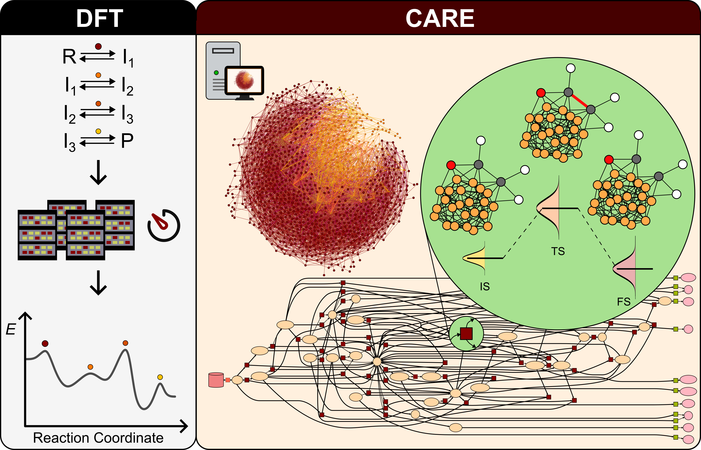

[](./LICENSE)

[](https://github.com/LopezGroup-ICIQ/care/actions/workflows/python-package.yml)
[](https://www.rdkit.org/)


# CARE: Catalysis Automated Reaction Evaluator

<div style="display: flex; justify-content: center; align-items: center;">
    <p align="center">
     
    </p>
</div>
 
 #

CARE (*Catalysis Automated Reaction Evaluator*) is a tool for generating and manipulating chemical reaction networks (CRNs) for catalysis on transition metal surfaces. CARE is powered with GAME-Net-UQ, a graph neural network with uncertainty quantification (UQ) targeting the DFT energy of relaxed species and transition states.

## Installation (in progress)

1. Clone the repo typing in the command prompt:

```bash
git clone git@github.com:LopezGroup-ICIQ/care.git
```

2. Enter the repo and run the bash script `create_env.sh`

```bash
cd care
./create_env.sh 
```

3. Install [Julia](https://julialang.org/) to run microkinetic simulations:

```bash
curl -fsSL https://install.julialang.org | sh
```

4. Install the required Julia dependencies creating the Julia environment provided by `Project.toml`

```bash
TODO
```

## Usage

The current way to generate CRNs in CARE requires setting up a .toml configuration file and running the following command:

```bash
cd scripts
python care_script.py -i INPUT.toml -o OUTDIR
```

This will generate a directory `OUTDIR` containing `crn.pkl` containing the constructed reaction network.
Details about setting up the configuration file are found in ``.

## How to access the CRN

```python
from pickle import load

with open('./C1O4/Pd111/crn.pkl', 'rb') as pickle_file:
    crn = load(pickle_file)
```

`crn` is a `care.ReactionNetwork` object which provides rapid access to the intermediates (`care.Intermediate`), elementary reactions (`care.ElementaryReaction`), and its properties as activation barrier `care.ElementaryReaction.e_act` and reaction energy `care.ElementaryReaction.e_rxn`.

To visualize a specific elementary step:

```python
crn.visualize_reaction(0)
```

## License

The code is released under the [MIT](./LICENSE) license.

## Reference

- **A Foundational Model for Reaction Networks on Metal Surfaces**  
  Authors: S. Morandi, O. Loveday, T. Renningholtz, S. Pablo-García, R. A. Vargas Hernáńdez, R. R. Seemakurthi, P. Sanz Berman, R. García-Muelas, A. Aspuru-Guzik, and N. López  
  DOI: [10.26434/chemrxiv-2024-bfv3d](https://doi.org/10.26434/chemrxiv-2024-bfv3d)
